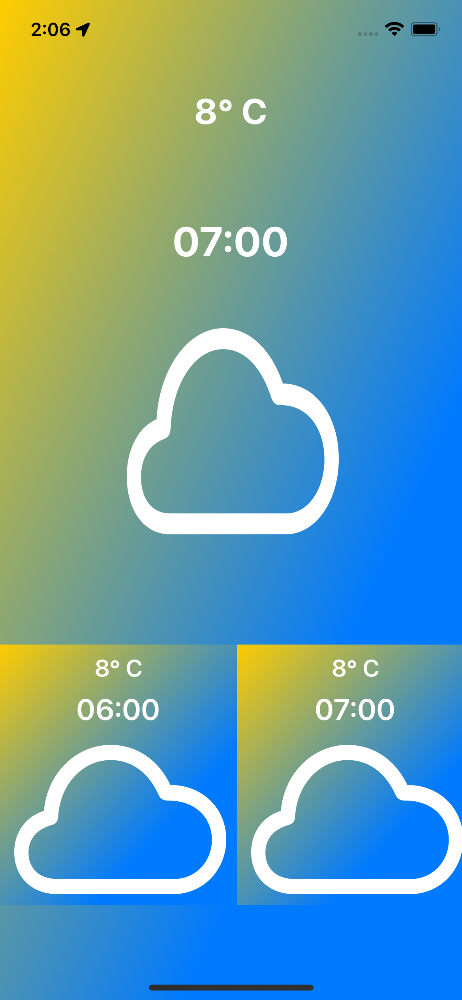
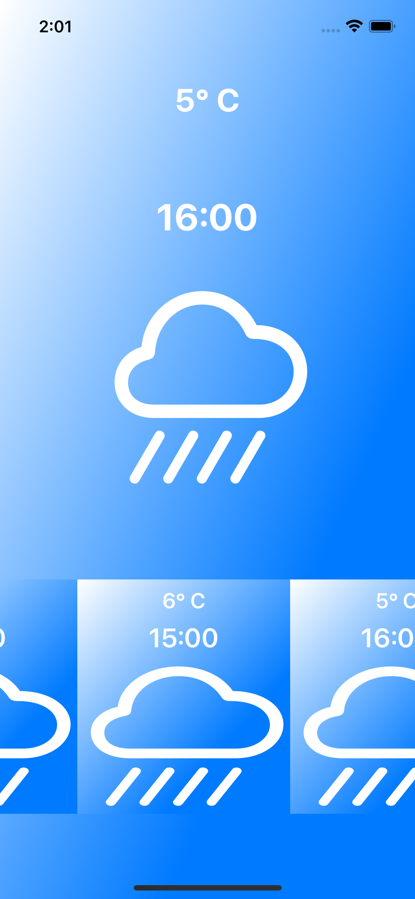
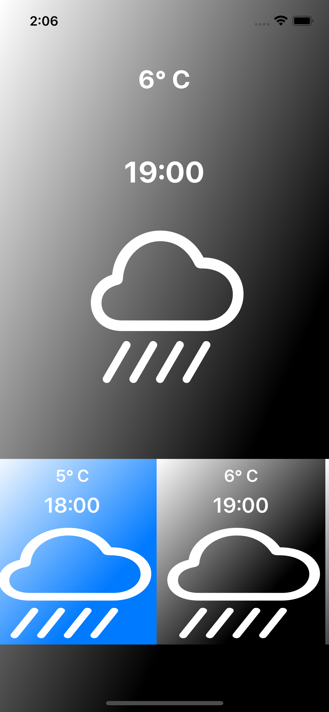

# WeatherApp

## API

- I used [stormglass](https://stormglass.io/) as weather data supplier.
- After getting [APIKEY](https://stormglass.io/)
- You may need [document](https://docs.stormglass.io/#/)

## ScreenShots

